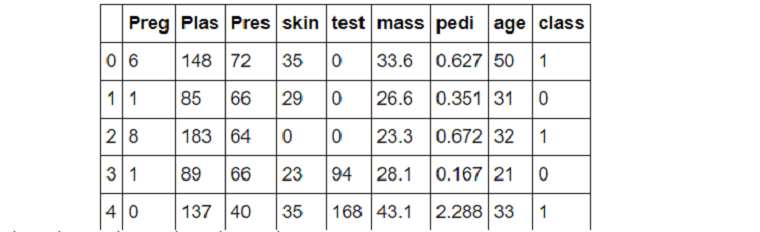
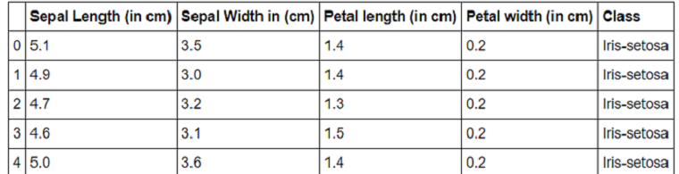
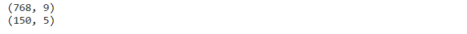
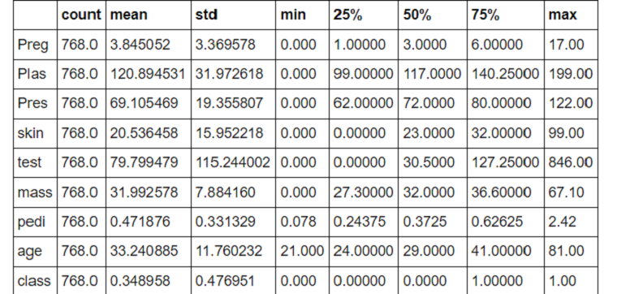
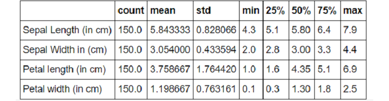
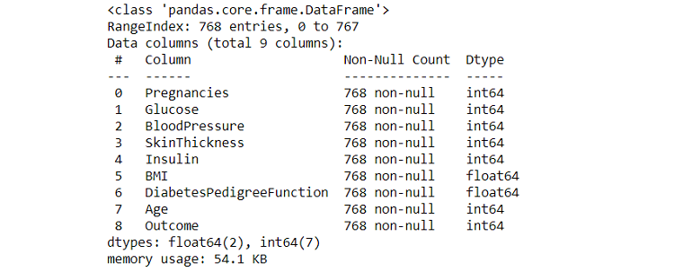
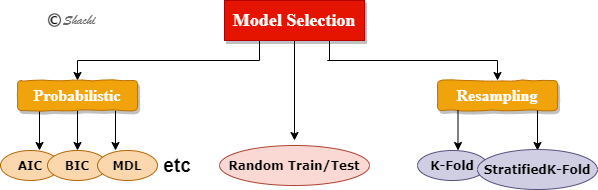
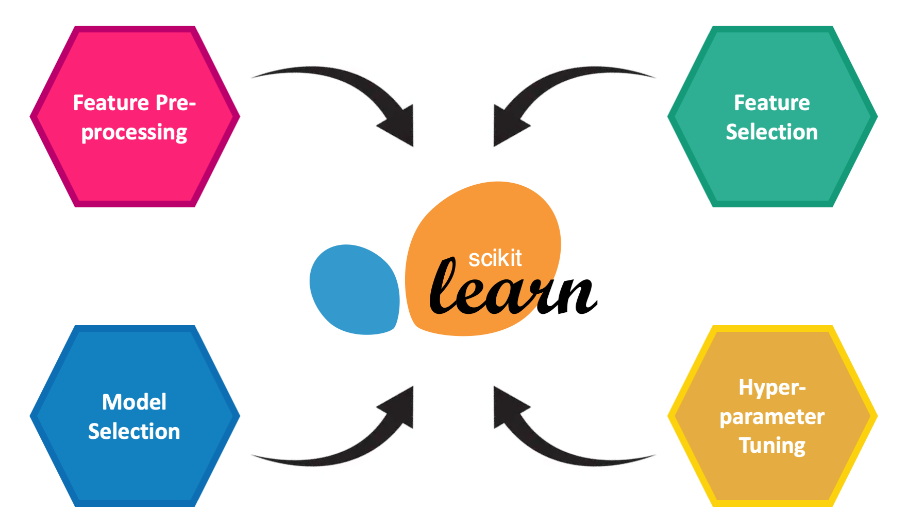
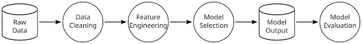

# Preprocessing

**IMPORTING LABRARIES**

The very frst and most important part of the data preprocessing is importing the libraries.Librareries are imported in the format given below in the code line the frst library that we have imported is pandas which is used for data exploring and cleaning after that we have imported numpy which is used for implementing large array functions and mathematical functions in our dataset next we have to import matplotlib and seborn which are used to plot graphs for better visualization of our data.

    import pandas as pd

    import numpy as np

    import matplotlib.pyplot as plt

    %matplotlib inline

    import seaborn as sns

**IMPORTING DATASET**

The next task in data preprocessing is to import the dataset. So for importing the dataset frst we have to know the location of our data that where it is stored in our device after that we have to use our pandas library to call the function read\_csv from which we can import our dataset

    sample=pd.read_csv('SampleSuperstore.csv')

After importing the dataset our next job has to be checking and cleaing our dataset. This is the important step towards the data exploration because if we do not clean our dataset and just working on it as it is there will be lots of mistakes and inaccurate data there and that will create a lots of problem in implementing our model on it as it will leads to some useless results that will of no use to us.So in cleaning the datast our frst part is to check wheater our dataset have null or 0 values in it. These values are no use and hence it is very important to eliminate that. This is can be done by the below code.

**CHECKING NULL VALUES**

    sample.isnull().sum()

The second step in cleaning the dataset after eliminating null values is dropping the duplicate values as duplicate values will misleads our exploration of dataset and might leads to some inappropriate results so it becomes important to drop these values this can be done by using the below code

**DROPPING DUPLICATES**

    sample.drop_duplicates()

The last important step that is involved in data checking and cleaning is checking the uniqe values so it bascially involves that how many different values are present in our data set this helps a lot in selection for models and other data visulization.

**UNIQUE VALUES**

    sample.unique()
 
# Data-Set Examination

## Exploratory Data Analysis

Exploratory data analysis is the process of analyzing and interpreting datasets while summarizing their particular characteristics with the help of data visualization methods.

### Importing the dataset

    import pandas as pd
    import matplotlib.pyplot as plt
    import seaborn as sns
    import warnings
    warnings.filterwarnings('ignore')
    
    import pandas as pd
    pima_df = pd.read_csv('pima.csv')
    iris_df= pd.read_csv('iris.csv')

### Printing the first five rows

    pima_df.head(5)

    iris_df.head(5)

### Shape of the dataset

    iris_df.shape
    pima_df.shape

### Descriptive Statistics

    pima_df.describe().transpose()

    iris_df.describe().transpose()

    iris_df.describe().transpose()

### Checking the correlation among different features

    pima_df.corr()

### Getting the information about datatypes of columns and information about null values

    pima_df.info()

# Model Selection and Hyper-Parameters Selection

## Model Selection

**Model selection** is the process of selecting one *final machine learning model* from among a collection of candidate machine learning models for a training dataset.

*Model selection* is a process that can be applied both across different types of models (e.g. *logistic regression, SVM, KNN*, etc.) and across models of the same type configured with different model hyperparameters (e.g. *different kernels in an SVM*).

We evaluate or assess candidate models in order to choose the best one, and this is **model selection**. Whereas once a model is chosen, it can be evaluated in order to communicate how well it is expected to perform in general; this is **model assessment**.

A ***good enough*** model may refer to many things and is specific to your project, such as:

*	A model that meets the requirements and constraints of project stakeholders.
*	A model that is sufficiently skilful given the time and resources available.
*	A model that is skilful as compared to naive models.
*	A model that is skilful relative to other tested models.
*	A model that is skilful relative to the state-of-the-art.

The best approach to model selection requires ***sufficient*** data, which may be nearly infinite depending on the complexity of the problem.

In this ideal situation, we would split the data into *training*, *validation*, and *test* sets, then fit candidate models on the ***training*** set, evaluate and select them on the ***validation*** set, and report the performance of the final model on the ***test*** set.

***Probabilistic*** measures involve analytically scoring a candidate model using both its performance on the *training* dataset and the complexity of the model.

A model with fewer parameters is less complex, and because of this, is preferred because it is likely to generalize better on average.

## Hyper-Parameters Selection

A ***hyperparameter*** can be loosely defined as a parameter that is not tuned during the learning phase that optimizes the main objective function on the training set. While a simple grid search would yield the optimal hyperparameters by trying all possible combinations of hyper parameters, it does not scale as the number of hyperparameters and the data set size increase. As a result, investigators typically choose hyperparameters arbitrarily, after a series of manual trials, which can sometimes cast doubts on the results as investigators might have been tempted to tune the parameters specifically for the test set.

For example, the *tree depth* in a decision tree model and the *number of layers* in an artificial neural network are typical hyperparameters. The performance of a model can drastically depend on the choice of its hyperparameters. A decision tree can yield good results for moderate tree depth and have very bad performance for very deep trees.

There are basically four methods for choosing hyper-parameters:

1. **Manual Search**: Using knowledge you have about the problem guess parameters and observe the result. Based on that result tweak the parameters. Repeat this process until you find parameters that work well or you run out of time.

1. **Grid Search**: Using knowledge you have about the problem identify ranges for the hyperparameters. Then select several points from those ranges, usually uniformly distributed. Train your network using every combination of parameters and select the combination that performs best. Alternatively, you can repeat your search on a narrower domain centred around the parameters that perform the best.

1. **Random Search**: Like grid search you use knowledge of the problem to identify ranges for the hyperparameters. However instead of picking values from those ranges in a methodical manner you instead select them at random. Repeat this process until you find parameters that work well or use what you learn to narrow your search. In the paper Random Search for Hyper-Parameter Optimization Dr. Bengio proposes this be the baseline method against which all other methods should be compared and shows that it tends to work better than the other methods.

1. **Bayesian Optimization**: More recent work has been focussed on improving upon these other approaches by using the information gained from any given experiment to decide how to adjust the hyper parameters for the next experiment. An example of this work would be Practical Bayesian Optimization of Machine Learning Algorithms by Adams et al.
